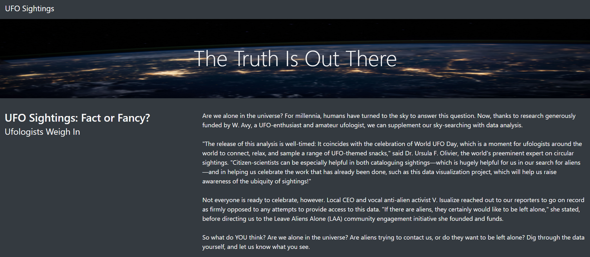
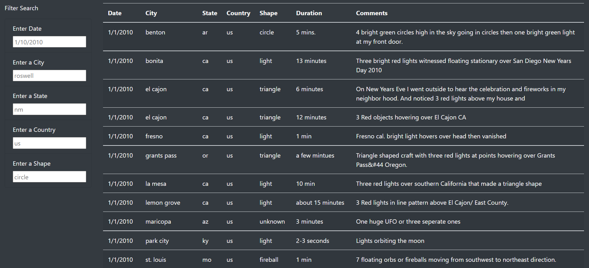
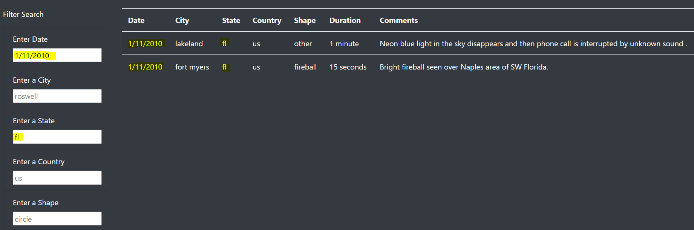
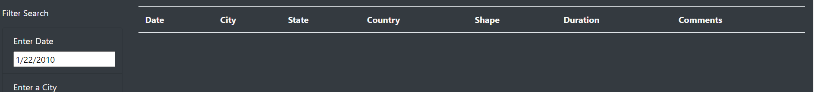
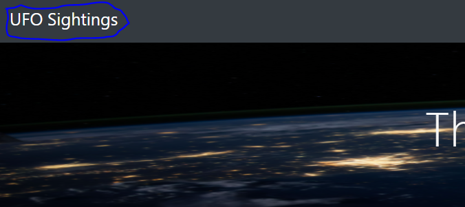

# UFO Finder
## Overview
### This project serves as a functional webpage for the exploration of data related to UFO sightings. The data, originally compiled in a JavaScript array, has been put into a dynamic table that allows the viewer to filter by date, city, state, country, and/or shape. 

## Resources
### Software/Programming Languages
- JavaScript
- Visual Studio Code
- Bootstrap 3
- HTML/CSS
### Data Source
- data.js

## Results
Upon visiting the webpage, a user will see an aesthetically pleasing image and headline, an introductory article, a table containing UFO sighting event data (including date, city, state, country, shape, duration, and comments), and options to filter the table by date, city, state, country, and/or shape.

By default, the table contains all rows of data. If the user wishes to look up events by specific criteria, they may type in the parameters they wish to see. As soon as they hit enter or click outside of a text box, the table will automatically update with the filtered results. In the highlighted example below, I've filtered to only show sightings on 1/11/2010 AND in the state of Florida.

If a search parameter does not match the data exactly, no data is returned, as is the case when searching for any sightings on 1/22/2010:

To reset to the default search (the full data table), either delete all previous text in the search input boxes, or click 'UFO Sightings' at the top of the page to refresh.

## Summary
One drawback of this filter design is the limitation to a singular input within each search parameter. I recommend updating the search code to allow for selecting a range of dates which provides a more straightforward view of trends related to the time of year. I also recommend adding a select multiple option to both the state and city search parameters so that multiple states and/or cities can be viewed at the same time. This will allow users to more easily see patterns in larger regions. 
